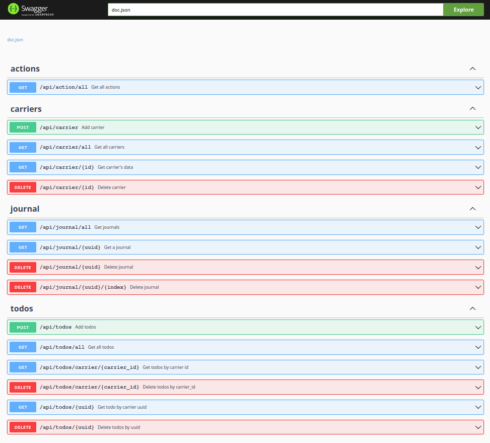
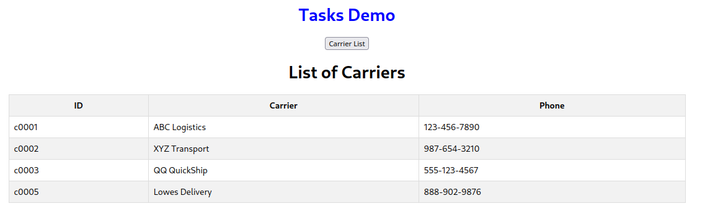

# SCTRACK

Created a todo list for a mini carrier demo. The app consists of a Web Service with several calls, supported by a 
Postgres database. The Postgres database has three tables to simulate a carrier and todo list.

## Render
This application is being hosted at Render, using the free tier. The following link points to the swagger page. 
If the app is not running, is because the free tier might have stopped it. Send me a message at 
alpha.aleph@gmail.com, and I'll be happy to get it started for you.  :-)

* Swagger link : https://sctrack.onrender.com/swagger/index.html#/



## React/Typescript
I'm learning React and Typescript to be more well-rounded.  :-)  So I did enough to show the list of
carriers in a table.  Of course the code can be improved, as I learn more, and I can add more pages. But
for now this is good. Gives me an idea of how the frontend interacts with the backend.

I cannot host this application in Render, as I only have the free tier.  But I'm including a pic of the one
page that I created to list all the carriers.



## Docker Hub
The application container and client can also be found in Docker Hub under:
```
server:  docker pull alphaaleph/sctrack:v0.1.3
client:  docker pull alphaaleph/sctrack-c:v0.1.3
```

## Database
The database provides four tables for the demo:
* carrier - holds a carrier's name and telephone
* todos - holds the todos for each carrier
* journal - used to keep track of the carrier's goings
* action - list of actions associated with todos

## Data
There is a Python and SQL scripts under the data directory that initializes the database with dummy data. Update the 
connection_url in the Python script if you want to point to a different Postgres database. The SQL script has some 
dummy data included.
```
cd ./data
python ./init.py
```

## Building
Included with the project, there is a script to build the application from the command line. After getting a copy of 
the project, run "build.sh" from the command line.  

The script will do the following:

* Build the web service application locally
* Auto generate the swagger page
* Build a web service docker image

## Packages
Some of the packages used in the program
* [gorilla mux](https://github.com/gorilla/mux) - router and dispatcher
* [postgres](github.com/lib/pq) - a Go postgres driver
* [slog](golang.org/x/exp/slog) - Go's structured logging
* [swaggo](https://github.com/swaggo/swag) - swagger documentation


## TODO
- [ ] refactor code and clean
- [ ] add update calls 
- [ ] add more react front-end 
- [ ] create similar project using MongoDB
- [ ] create similar project using ORM and SQlite
- [ ] add api call to Patch the todos completed flag
