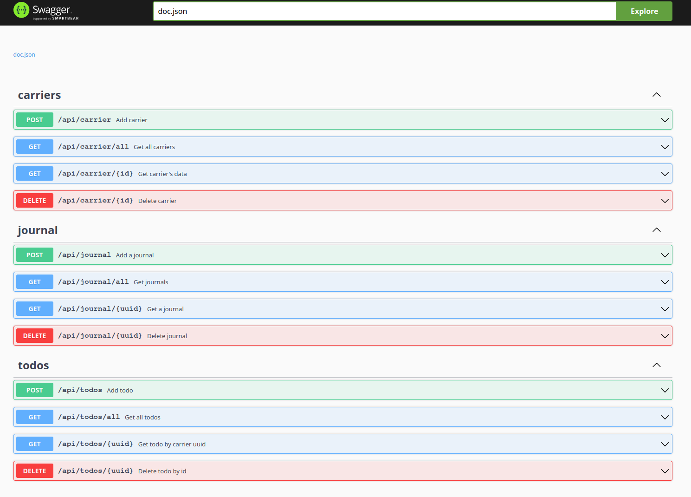

# SCTRACK

Created a todo list for a mini carrier demo. The app consists of a Web Service with several calls, supported by a 
Postgres database. The Postgres database has three tables to simulate a carrier and todo list.

## Render
This application is being hosted at Render, using the free tier. The following links point to the swagger and UI. 
If the app is not running, is because the free tier might have stopped it. Send me a message at 
alpha.aleph@gmail.com, and I'll be happy to get it started for you.  :-)

* Swagger link :
* React UX link :

## Docker Hub
The application container will also be served in Docker Hub under:

*

## Database
The database provides three tables for the demo:
* carrier - holds a carrier's name and telephone
* todos - holds the todos for each carrier
* journal - used to keep track of the carrier's goings

## Building
Included with the project, there is a script to build the application from the command line. After getting a copy of 
the project, run "build.sh" from the command line.  

The script will do the following:

* Build the web service application locally
* Update the configuration file for local runs
* Auto generate the swagger page
* Build a web service docker image

## Swagger

